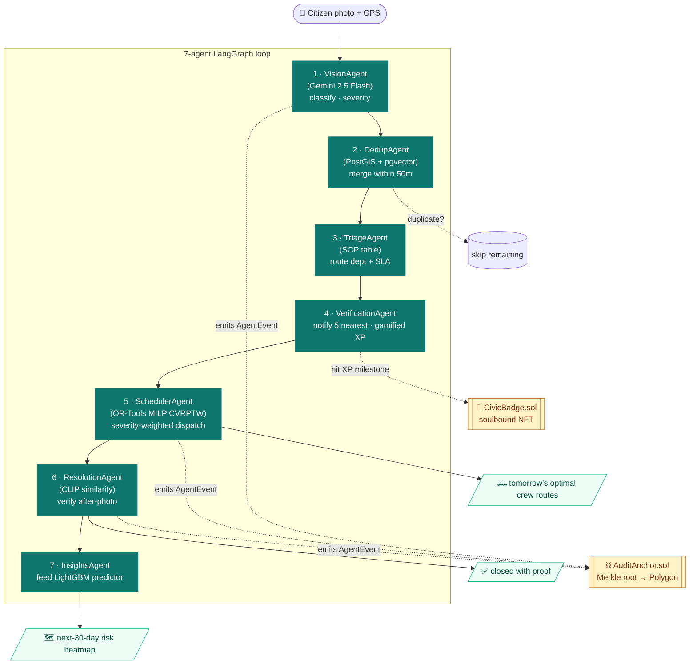

# NagarikAI — Agent Graph

```mermaid
flowchart TD
    citizen([🧍 Citizen photo + GPS])
    citizen --> A1

    subgraph LangGraph[" 7-agent LangGraph loop "]
        direction TB
        A1["1 · VisionAgent\n(Gemini 2.5 Flash)\nclassify · severity"]
        A2["2 · DedupAgent\n(PostGIS + pgvector)\nmerge within 50m"]
        A3["3 · TriageAgent\n(SOP table)\nroute dept + SLA"]
        A4["4 · VerificationAgent\nnotify 5 nearest · gamified XP"]
        A5["5 · SchedulerAgent\n(OR-Tools MILP CVRPTW)\nseverity-weighted dispatch"]
        A6["6 · ResolutionAgent\n(CLIP similarity)\nverify after-photo"]
        A7["7 · InsightsAgent\nfeed LightGBM predictor"]
        A1 --> A2 --> A3 --> A4 --> A5 --> A6 --> A7
    end

    A2 -. duplicate? .-> drop[(skip remaining)]
    A7 --> heatmap[/🗺️ next-30-day risk heatmap/]
    A5 --> dispatch[/🛻 tomorrow's optimal crew routes/]
    A6 --> resolved[/✅ closed with proof/]

    A1 -.->|emits AgentEvent| chain
    A5 -.->|emits AgentEvent| chain
    A6 -.->|emits AgentEvent| chain
    chain[[⛓ AuditAnchor.sol\nMerkle root → Polygon]]

    A4 -.->|hit XP milestone| badge[[🏅 CivicBadge.sol\nsoulbound NFT]]

    classDef agent fill:#0f766e,stroke:#0f766e,color:#fff
    classDef out   fill:#ecfdf5,stroke:#10b981,color:#064e3b
    classDef chain fill:#fef3c7,stroke:#b45309,color:#7c2d12
    class A1,A2,A3,A4,A5,A6,A7 agent
    class heatmap,dispatch,resolved out
    class chain,badge chain
```

Edit source: [`agent_graph.mmd`](agent_graph.mmd). Render to SVG with `mmdc -i agent_graph.mmd -o agent_graph.svg`.
